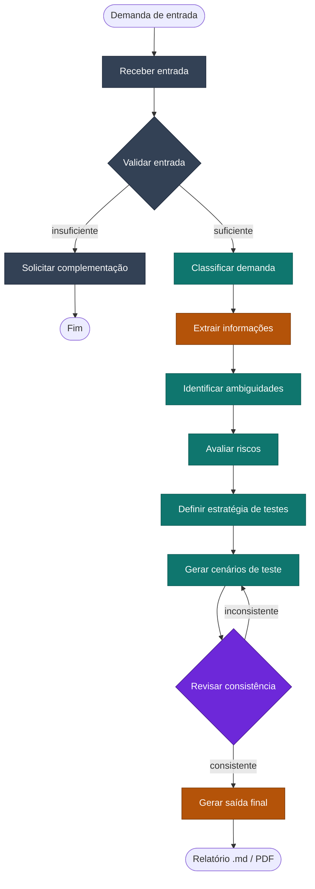

# Agente de QA (LangGraph JS)

Agente de IA construído com **LangGraph JS**, Node.js e TypeScript que recebe uma demanda técnica
de QA (história de usuário, bug, deploy, alteração de API, mudança em banco, texto livre etc.) e
gera cenários de teste, checklist de validação, riscos e recomendações — em Markdown, com PDF
opcional.

- Visão geral e arquitetura: [`docs/arquitetura/visao-geral-agente.md`](docs/arquitetura/visao-geral-agente.md)
- Rastreabilidade de prompts: [`docs/prompts/`](docs/prompts/README.md)
- Exemplo real de entrada/saída: [`docs/exemplos/exemplo-entrada-saida.md`](docs/exemplos/exemplo-entrada-saida.md)
- Como contribuir: [`CONTRIBUTING.md`](CONTRIBUTING.md)

## Sumário

- [Como funciona](#como-funciona)
- [Pré-requisitos](#pré-requisitos)
- [Como executar](#como-executar)
- [Gerar o relatório em PDF](#gerar-o-relatório-em-pdf)
- [Scripts disponíveis](#scripts-disponíveis)
- [Estrutura do projeto](#estrutura-do-projeto)
- [Documentação adicional](#documentação-adicional)

## Como funciona



- 🔵 **cinza** — passo determinístico, sem chamar o LLM.
- 🟢 **verde** — chamada estruturada ao LLM (Groq), validada com Zod.
- 🟣 **roxo** — híbrido: regras determinísticas de cobertura primeiro, LLM para coerência semântica depois; reprovação volta para "Gerar cenários" (retry controlado).
- 🟠 **laranja** — usa *tool calling*: em "Extrair informações" o próprio LLM escolhe qual tool de análise aplicar (`analisar_texto_livre`, `analisar_alteracao_api` ou `analisar_documento_markdown`, ver [`src/tools/analysis-tools.ts`](src/tools/analysis-tools.ts)); em "Gerar saída final" o nó aciona as tools de relatório (`gerar_relatorio_markdown` / `gerar_relatorio_pdf`, ver [`src/tools/output-tools.ts`](src/tools/output-tools.ts)).

Cada nó lê/atualiza o `AgentState` compartilhado (ver [`src/state.ts`](src/state.ts) e o grafo em
[`src/graph.ts`](src/graph.ts)) — é essa memória acumulada ao longo do fluxo (classificação,
premissas, riscos, cenários) que alimenta a saída final. Detalhes de cada nó, decisões do agente
e limitações da solução estão em [`docs/arquitetura/visao-geral-agente.md`](docs/arquitetura/visao-geral-agente.md).

## Pré-requisitos

- **Node.js 18+** e **npm** (ESM nativo, ver [`tsconfig.json`](tsconfig.json)).
- Uma chave de API da **[Groq](https://console.groq.com/keys)**.

Variáveis de ambiente (copie `.env.example` para `.env`):

| Variável | Para que serve |
|---|---|
| `GROQ_API_KEY` | Chave de API da Groq (obrigatória). |
| `GROQ_MODEL` | Modelo principal (padrão: `openai/gpt-oss-120b`). |
| `GROQ_FALLBACK_MODELS` | Lista de modelos alternativos, em ordem, usados se o principal falhar. |
| `GROQ_MAX_RATE_LIMIT_WAIT_SECONDS` | Tempo máximo de espera automática em limites curtos (por minuto). |

Se o modelo principal falhar, o agente tenta os fallbacks automaticamente; esperas curtas de
limite por minuto são respeitadas e repetidas, limites diários seguem direto para o próximo
modelo. O raciocínio completo por trás dessa escolha (por que esses modelos, o que foi
descartado e por quê) está registrado em
[`docs/arquitetura/decisoes-tecnicas.md`](docs/arquitetura/decisoes-tecnicas.md).

## Como executar

```bash
git clone <url-do-repositorio>
cd projeto-agente_qa
npm install
cp .env.example .env   # preencha GROQ_API_KEY
```

```bash
# texto direto
npm run agent -- "Como usuário quero recuperar minha senha por e-mail"

# a partir de um arquivo (.txt ou .md)
npm run agent -- examples-testes/demanda-login.txt

# qualquer uma das anteriores + geração do PDF ao final
npm run agent -- examples-testes/demanda-login.txt --pdf
```

Uma execução completa leva de alguns segundos a cerca de um minuto, dependendo da demanda e do
modelo. Se a entrada não tiver informação suficiente, o agente não gera cenários — retorna um
relatório curto pedindo mais detalhes (nó "Solicitar complementação" no diagrama acima).

O resultado é exibido no console em Markdown e salvo automaticamente em
`docs/outputs/<slug-da-demanda>-<data-hora>.md`, com classificação, resumo técnico, premissas,
informações faltantes, cenários por categoria, checklist, riscos e recomendações. Veja um
exemplo real completo em
[`docs/exemplos/exemplo-entrada-saida.md`](docs/exemplos/exemplo-entrada-saida.md).

## Gerar o relatório em PDF

```bash
npm run generate:pdf -- docs/outputs/<nome-do-arquivo-gerado-pelo-agente>.md
```

Converte o Markdown em HTML (template técnico de QA com capa e apêndice), renderiza em PDF com
cabeçalho/rodapé/numeração e salva em `docs/pdfs/` sem sobrescrever execuções anteriores.
Bibliotecas: `puppeteer` (render), `markdown-it` (conversão), `dayjs` (datas) — ver
[`src/generate-pdf.ts`](src/generate-pdf.ts), [`src/services/`](src/services/) e
[`src/templates/qa-report.template.ts`](src/templates/qa-report.template.ts).

## Scripts disponíveis

| Script | Comando | Descrição |
|---|---|---|
| Executar o agente | `npm run agent -- <texto ou caminho> [--pdf]` | Roda o agente sobre uma demanda e salva o resultado em `docs/outputs/`; com `--pdf`, também gera o PDF em `docs/pdfs/`. |
| Gerar PDF | `npm run generate:pdf -- <caminho.md>` | Converte um relatório Markdown em PDF em `docs/pdfs/`. |
| Checar tipos | `npm run typecheck` | Roda `tsc --noEmit` sobre `src/` e `scripts/`. |
| Lint | `npm run lint` (ou `npm run lint:fix`) | Roda o ESLint sobre o projeto (ver [`eslint.config.js`](eslint.config.js)). |
| Rodar testes | `npm test` | Roda os testes unitários (`node:test` via `tsx`). |
| Validar prompts | `npm run validate:prompts` | Garante que `docs/prompts/` está estruturalmente correto (ver [`CONTRIBUTING.md`](CONTRIBUTING.md)). |

## Estrutura do projeto

```
src/
  nodes/        nós do grafo LangGraph (um por etapa do fluxo do agente)
  tools/        tools LangChain: análises especializadas (tool calling) e geração de relatórios
  format/       serialização do estado final em Markdown
  services/     conversão Markdown → HTML e geração do PDF
  templates/     template HTML do relatório em PDF
  styles/       CSS do relatório em PDF
  prompts.ts     prompts operacionais enviados ao LLM em tempo de execução
  schemas.ts     schemas Zod de validação da saída estruturada do LLM
  state.ts       estado do grafo (AgentState) e suas transições
  graph.ts       montagem do StateGraph (nós e arestas)
  index.ts       CLI de entrada (npm run agent)
docs/
  arquitetura/   visão geral do agente e decisões técnicas
  prompts/       registro versionado de todos os prompts (engenharia e operacionais)
  exemplos/      exemplo real de entrada e saída de uma execução
  outputs/       relatórios Markdown gerados (ignorados no git)
  pdfs/          PDFs gerados (ignorados no git)
examples-testes/ demandas de exemplo para testar o agente manualmente
scripts/         scripts de suporte (validação de prompts, git hooks)
```

## Documentação adicional

- [`docs/arquitetura/visao-geral-agente.md`](docs/arquitetura/visao-geral-agente.md) — problema,
  objetivo, entradas aceitas, fluxo detalhado e limitações da solução (seção 9).
- [`docs/arquitetura/decisoes-tecnicas.md`](docs/arquitetura/decisoes-tecnicas.md) — decisões de
  arquitetura e configuração derivadas dos prompts de engenharia.
- [`docs/exemplos/exemplo-entrada-saida.md`](docs/exemplos/exemplo-entrada-saida.md) — exemplo
  real de entrada e saída de uma execução completa do agente.
- [`docs/prompts/README.md`](docs/prompts/README.md) — convenção de nomenclatura, versionamento
  e estrutura dos registros de prompt.
- [`CONTRIBUTING.md`](CONTRIBUTING.md) — fluxo de branches, convenção de commits e checklist
  antes de abrir um PR.
- [`.github/workflows/ci.yml`](.github/workflows/ci.yml) — pipeline de CI (typecheck, lint,
  testes e validação de prompts) executado a cada push/PR para `main` e `develop`.
